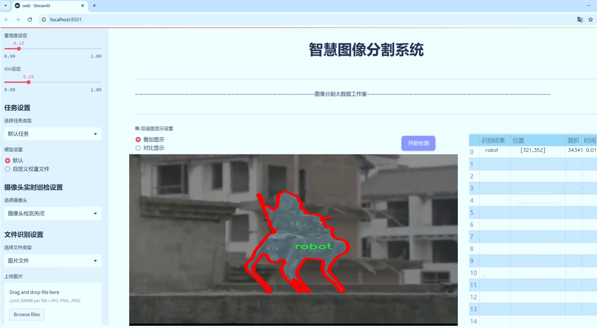
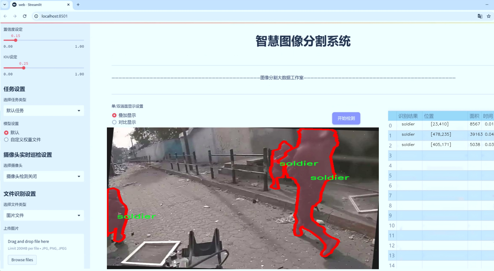
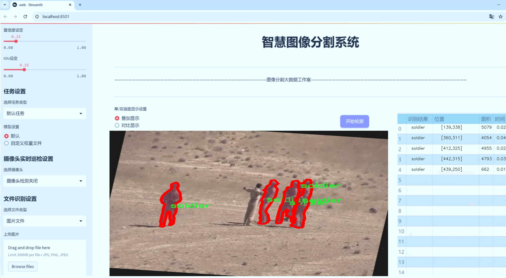
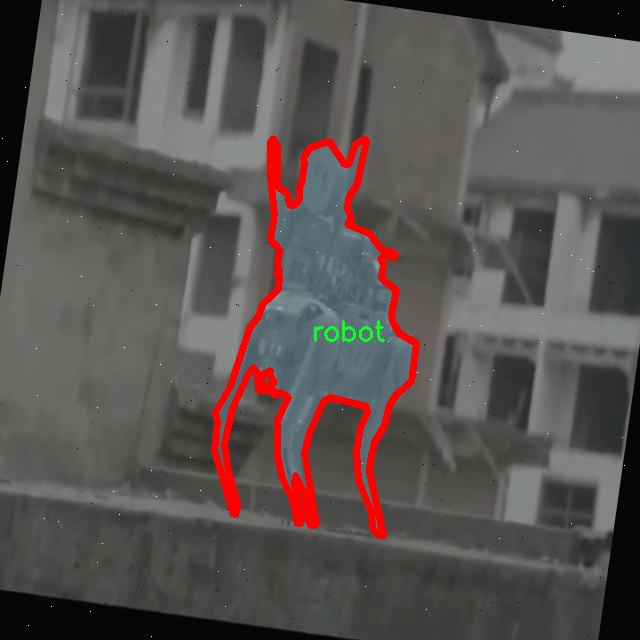
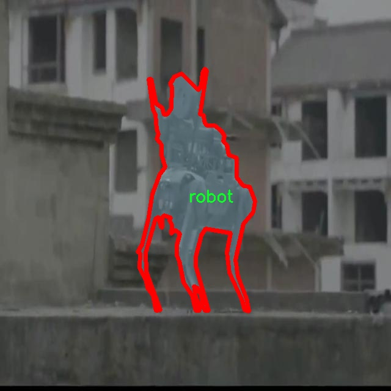
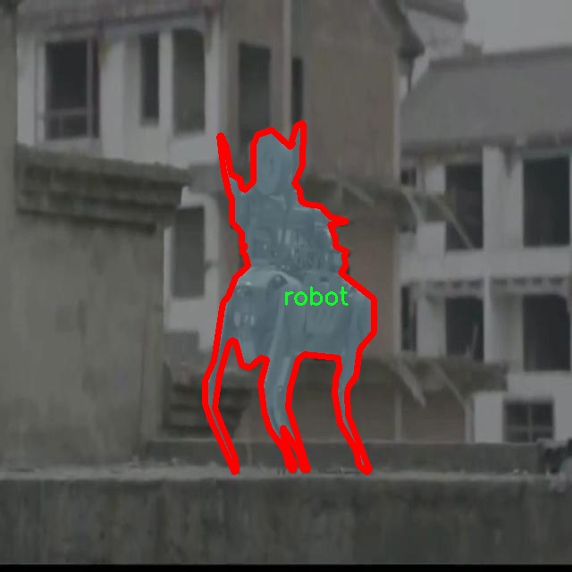
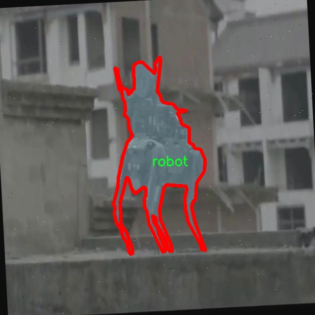
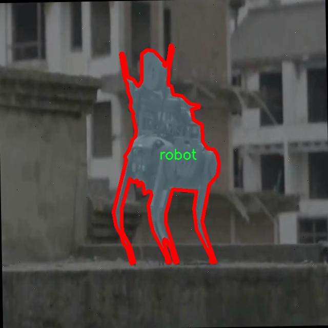

# 国外军事目标图像分割系统源码＆数据集分享
 [yolov8-seg-C2f-DySnakeConv＆yolov8-seg-fasternet等50+全套改进创新点发刊_一键训练教程_Web前端展示]

### 1.研究背景与意义

项目参考[ILSVRC ImageNet Large Scale Visual Recognition Challenge](https://gitee.com/YOLOv8_YOLOv11_Segmentation_Studio/projects)

项目来源[AAAI Global Al lnnovation Contest](https://kdocs.cn/l/cszuIiCKVNis)

研究背景与意义

随着全球军事技术的迅速发展，军事目标的识别与监测已成为现代战争中至关重要的环节。传统的目标识别方法往往依赖于人工分析和简单的图像处理技术，效率低下且易受人为因素的影响。近年来，深度学习技术的飞速进步为军事目标的自动化识别提供了新的解决方案。特别是基于卷积神经网络（CNN）的目标检测与分割算法，如YOLO（You Only Look Once）系列，因其高效性和实时性在各类应用中得到了广泛关注。

YOLOv8作为YOLO系列的最新版本，具备了更强的特征提取能力和更高的检测精度，适用于复杂的军事场景。然而，现有的YOLOv8模型在处理特定的军事目标图像时，仍然面临一些挑战，例如在复杂背景下的目标遮挡、目标的多样性以及图像质量的差异等。因此，改进YOLOv8以适应军事目标图像分割的需求，成为了一个重要的研究方向。

本研究基于一个包含1900幅图像的军事目标数据集，涵盖了9个类别，包括飞机、直升机、导弹、降落伞、机器人、士兵、红外士兵、坦克和红外坦克。这些类别不仅反映了现代战争中常见的军事装备和人员，还体现了多样化的作战环境。通过对这些图像进行实例分割，可以更准确地识别和定位不同类型的军事目标，为后续的战术决策提供重要依据。

本研究的意义在于，首先，通过改进YOLOv8模型，可以提高对复杂军事目标的识别和分割精度，增强模型在实际应用中的可靠性。其次，利用丰富的标注数据集，能够有效地训练和验证模型的性能，为未来的军事图像处理技术提供坚实的基础。此外，研究成果将为军事领域的智能化发展提供新的思路，推动人工智能技术在国防安全、战场监控等方面的应用。

在全球安全形势日益复杂的背景下，军事目标的快速、准确识别显得尤为重要。通过对改进YOLOv8的研究，不仅可以提升军事目标图像分割的技术水平，还能够为各国军队在信息化战争中提供更为精准的战场态势感知能力。这将为军事决策提供科学依据，减少误判和损失，提升作战效率，具有重要的理论价值和现实意义。

综上所述，本研究不仅关注技术的改进，更强调其在实际军事应用中的潜在影响。通过深入探讨YOLOv8在军事目标图像分割中的应用，期望为未来的军事智能化发展贡献一份力量。

### 2.图片演示







##### 注意：由于此博客编辑较早，上面“2.图片演示”和“3.视频演示”展示的系统图片或者视频可能为老版本，新版本在老版本的基础上升级如下：（实际效果以升级的新版本为准）

  （1）适配了YOLOV8的“目标检测”模型和“实例分割”模型，通过加载相应的权重（.pt）文件即可自适应加载模型。

  （2）支持“图片识别”、“视频识别”、“摄像头实时识别”三种识别模式。

  （3）支持“图片识别”、“视频识别”、“摄像头实时识别”三种识别结果保存导出，解决手动导出（容易卡顿出现爆内存）存在的问题，识别完自动保存结果并导出到tempDir中。

  （4）支持Web前端系统中的标题、背景图等自定义修改，后面提供修改教程。

  另外本项目提供训练的数据集和训练教程,暂不提供权重文件（best.pt）,需要您按照教程进行训练后实现图片演示和Web前端界面演示的效果。

### 3.视频演示

[3.1 视频演示](https://www.bilibili.com/video/BV1kaS7YUENz/)

### 4.数据集信息展示

##### 4.1 本项目数据集详细数据（类别数＆类别名）

nc: 9
names: ['airplane', 'helicopter', 'missile', 'parachute', 'robot', 'soldier', 'soldier-IR-', 'tank', 'tank-IR-']


##### 4.2 本项目数据集信息介绍

数据集信息展示

在现代军事图像处理领域，图像分割技术的应用愈发重要，尤其是在目标检测和识别方面。为此，我们构建了一个名为“Masking”的数据集，旨在为改进YOLOv8-seg模型提供高质量的训练数据，以实现对各种军事目标的精确分割和识别。该数据集的设计充分考虑了军事环境的复杂性和多样性，涵盖了九个关键类别，分别是：飞机、直升机、导弹、降落伞、机器人、士兵、红外士兵、坦克以及红外坦克。这些类别的选择不仅反映了现代军事作战中常见的目标类型，也为模型的训练提供了丰富的样本。

“Masking”数据集中的每个类别都经过精心标注，确保每个目标在图像中的轮廓清晰可辨。数据集的构建过程涉及大量的实地拍摄和图像处理，确保了数据的真实性和多样性。飞机和直升机作为空中作战的重要工具，具有不同的外形特征和飞行姿态，因此在数据集中提供了多种角度和光照条件下的图像，以增强模型对这些目标的识别能力。导弹和降落伞则代表了空中投放和空降作战的关键元素，数据集中包含了它们在不同环境下的表现，帮助模型学习到更为复杂的目标分割任务。

在地面作战方面，士兵和坦克是不可或缺的元素。数据集中不仅包含了常规士兵的图像，还特别增加了红外士兵的样本，以应对夜间作战和低能见度环境下的目标检测需求。坦克的图像则涵盖了多种型号和作战场景，确保模型能够适应不同的战斗环境。机器人作为现代战争中日益重要的辅助力量，其在数据集中的存在为模型提供了对新兴战斗单元的识别能力。

此外，数据集的构建还特别考虑了多样化的背景和场景，以模拟真实的战斗环境。这些背景不仅包括城市战斗、森林、沙漠等自然环境，还涵盖了各种复杂的战斗场景，确保模型在不同情况下的鲁棒性。通过这种方式，数据集不仅为模型提供了丰富的训练样本，也增强了其在实际应用中的适应能力。

总之，“Masking”数据集的设计和构建充分考虑了军事目标图像分割的实际需求，涵盖了多种目标类别和复杂的场景设置，为改进YOLOv8-seg模型提供了强有力的支持。通过对该数据集的训练，期望能够提升模型在军事图像分割任务中的表现，使其在实际应用中能够更好地服务于军事侦察、监视和战斗决策等领域。随着数据集的不断扩展和优化，我们相信其在军事图像处理领域的应用前景将更加广阔。











### 5.全套项目环境部署视频教程（零基础手把手教学）

[5.1 环境部署教程链接（零基础手把手教学）](https://www.bilibili.com/video/BV1jG4Ve4E9t/?vd_source=bc9aec86d164b67a7004b996143742dc)


[5.2 安装Python虚拟环境创建和依赖库安装视频教程链接（零基础手把手教学）](https://www.bilibili.com/video/BV1nA4VeYEze/?vd_source=bc9aec86d164b67a7004b996143742dc)

### 6.手把手YOLOV8-seg训练视频教程（零基础小白有手就能学会）

[6.1 手把手YOLOV8-seg训练视频教程（零基础小白有手就能学会）](https://www.bilibili.com/video/BV1cA4VeYETe/?vd_source=bc9aec86d164b67a7004b996143742dc)


按照上面的训练视频教程链接加载项目提供的数据集，运行train.py即可开始训练



     Epoch   gpu_mem       box       obj       cls    labels  img_size
     1/200     0G   0.01576   0.01955  0.007536        22      1280: 100%|██████████| 849/849 [14:42<00:00,  1.04s/it]
               Class     Images     Labels          P          R     mAP@.5 mAP@.5:.95: 100%|██████████| 213/213 [01:14<00:00,  2.87it/s]
                 all       3395      17314      0.994      0.957      0.0957      0.0843

     Epoch   gpu_mem       box       obj       cls    labels  img_size
     2/200     0G   0.01578   0.01923  0.007006        22      1280: 100%|██████████| 849/849 [14:44<00:00,  1.04s/it]
               Class     Images     Labels          P          R     mAP@.5 mAP@.5:.95: 100%|██████████| 213/213 [01:12<00:00,  2.95it/s]
                 all       3395      17314      0.996      0.956      0.0957      0.0845

     Epoch   gpu_mem       box       obj       cls    labels  img_size
     3/200     0G   0.01561    0.0191  0.006895        27      1280: 100%|██████████| 849/849 [10:56<00:00,  1.29it/s]
               Class     Images     Labels          P          R     mAP@.5 mAP@.5:.95: 100%|███████   | 187/213 [00:52<00:00,  4.04it/s]
                 all       3395      17314      0.996      0.957      0.0957      0.0845


### 7.50+种全套YOLOV8-seg创新点代码加载调参视频教程（一键加载写好的改进模型的配置文件）

[7.1 50+种全套YOLOV8-seg创新点代码加载调参视频教程（一键加载写好的改进模型的配置文件）](https://www.bilibili.com/video/BV1Hw4VePEXv/?vd_source=bc9aec86d164b67a7004b996143742dc)

### 8.YOLOV8-seg图像分割算法原理

原始YOLOv8-seg算法原理

YOLOv8-seg算法是YOLO系列中的最新一代目标检测与分割算法，由Glenn-Jocher提出，旨在在继承YOLOv5的基础上，进一步提升检测精度和效率。YOLOv8-seg不仅保留了YOLO系列一贯的实时性，还在网络结构、损失函数、数据处理等多个方面进行了创新和优化，尤其是在图像分割任务中展现出卓越的性能。

首先，YOLOv8-seg在数据预处理阶段采用了YOLOv5的策略，利用马赛克增强、混合增强、空间扰动和颜色扰动等多种增强手段，以丰富训练数据的多样性。这些数据增强技术能够有效提升模型的泛化能力，使其在面对复杂背景和多样目标时，依然能够保持高效的检测和分割性能。

在网络结构方面，YOLOv8-seg的骨干网络依然基于YOLOv5的CSPDarknet设计，但将C3模块替换为新型的C2f模块。C2f模块的设计灵感来源于YOLOv7的ELAN思想，具有更丰富的分支结构，从而在梯度回传时提供更多的支流。这种结构的引入不仅增强了特征提取的能力，还在一定程度上缓解了深层网络中的梯度消失问题，使得网络能够更有效地学习到目标的特征信息。

YOLOv8-seg继续采用FPN（特征金字塔网络）和PAN（路径聚合网络）相结合的结构，以实现多尺度特征的有效融合。通过自下而上的高层特征与中层、浅层特征的融合，YOLOv8-seg能够更好地捕捉到不同尺度目标的细节信息。这种特征融合策略使得模型在处理不同大小的目标时，能够保持较高的检测精度和分割质量。

在检测头的设计上，YOLOv8-seg采用了解耦头结构，将分类和定位任务分开处理。具体而言，模型通过两条并行的分支分别提取类别特征和位置特征，然后通过1×1卷积层完成分类和定位任务。这种解耦设计使得模型在处理复杂场景时，能够更灵活地应对目标的多样性，提升了整体的检测性能。

在标签分配策略上，YOLOv8-seg引入了动态标签分配策略，采用了TOOD（Task-Aligned Object Detection）策略。这一策略的核心在于通过目标框和目标分数的动态匹配，解决了正负样本匹配的多尺度分配问题。与以往的静态匹配策略相比，TOOD策略能够更好地适应不同数据集的特征分布，从而提高了模型的训练效率和检测精度。

损失函数方面，YOLOv8-seg采用了Varifocal Loss（VFL）作为分类损失，结合CIoU Loss和DFL Loss作为回归损失。VFL通过不对称参数对正负样本进行加权，使得模型在训练过程中能够更加关注高质量的正样本，提升了对小目标的检测能力。同时，CIoU Loss和DFL Loss的结合，进一步优化了目标框的回归精度，使得模型在定位任务上表现更加出色。

YOLOv8-seg的轻量化设计也是其一大亮点。通过对C2f模块的优化，YOLOv8-seg在保持检测精度的同时，显著降低了模型的计算复杂度。这一设计使得YOLOv8-seg能够在资源受限的环境中高效运行，适用于实时目标检测与分割任务。

综上所述，YOLOv8-seg算法通过对数据预处理、网络结构、标签分配、损失函数等多个方面的创新与优化，提升了目标检测与分割的性能。其在实时性和精度上的双重优势，使得YOLOv8-seg在计算机视觉领域中展现出广泛的应用前景。无论是在智能监控、自动驾驶还是医学影像分析等领域，YOLOv8-seg都能够提供高效、准确的解决方案，推动目标检测与分割技术的进一步发展。


### 9.系统功能展示（检测对象为举例，实际内容以本项目数据集为准）

图9.1.系统支持检测结果表格显示

  图9.2.系统支持置信度和IOU阈值手动调节

  图9.3.系统支持自定义加载权重文件best.pt(需要你通过步骤5中训练获得)

  图9.4.系统支持摄像头实时识别

  图9.5.系统支持图片识别

  图9.6.系统支持视频识别

  图9.7.系统支持识别结果文件自动保存

  图9.8.系统支持Excel导出检测结果数据


### 10.50+种全套YOLOV8-seg创新点原理讲解（非科班也可以轻松写刊发刊，V11版本正在科研待更新）

#### 10.1 由于篇幅限制，每个创新点的具体原理讲解就不一一展开，具体见下列网址中的创新点对应子项目的技术原理博客网址【Blog】：


[10.1 50+种全套YOLOV8-seg创新点原理讲解链接](https://gitee.com/qunmasj/good)

#### 10.2 部分改进模块原理讲解(完整的改进原理见上图和技术博客链接)【如果此小节的图加载失败可以通过CSDN或者Github搜索该博客的标题访问原始博客，原始博客图片显示正常】

### YOLOv8简介


由上图可以看出，C2中每个BottlNeck的输入Tensor的通道数channel都只是上一级的0.5倍，因此计算量明显降低。从另一方面讲，梯度流的增加，t也能够明显提升收敛速度和收敛效果。
C2i模块首先以输入tensor(n.c.h.w)经过Conv1层进行split拆分，分成两部分(n,0.5c,h,w)，一部分直接经过n个Bottlenck，另一部分经过每一操作层后都会以(n.0.5c,h,w)的尺寸进行Shortcut，最后通过Conv2层卷积输出。也就是对应n+2的Shortcut(第一层Conv1的分支tensor和split后的tensor为2+n个bottenlenneck)。
#### Neck
YOLOv8的Neck采用了PANet结构，如下图所示。

Backbone最后SPPF模块(Layer9)之后H、W经过32倍下采样，对应地Layer4经过8倍下采样，Layer6经过16倍下采样。输入图片分辨率为640*640，得到Layer4、Layer6、Layer9的分辨率分别为80*80、40*40和20*20。
Layer4、Layer6、Layer9作为PANet结构的输入，经过上采样，通道融合，最终将PANet的三个输出分支送入到Detect head中进行Loss的计算或结果解算。
与FPN(单向，自上而下)不同的是，PANet是一个双向通路网络，引入了自下向上的路径，使得底层信息更容易传递到顶层。
#### Head
Head部分相比Yolov5改动较大，直接将耦合头改为类似Yolo的解耦头结构(Decoupled-Head)，将回归分支和预测分支分离，并针对回归分支使用了Distribution Focal Loss策略中提出的积分形式表示法。之前的目标检测网络将回归坐标作为一个确定性单值进行预测，DFL将坐标转变成一个分布。


### LSKNet的架构
该博客提出的结构层级依次为：

LSK module（大核卷积序列+空间选择机制） < LSK Block （LK Selection + FFN）<LSKNet（N个LSK Block）


#### LSK 模块

LSK Block
LSKNet 是主干网络中的一个可重复堆叠的块（Block），每个LSK Block包括两个残差子块，即大核选择子块（Large Kernel Selection，LK Selection）和前馈网络子块（Feed-forward Network ，FFN），如图8。LK Selection子块根据需要动态地调整网络的感受野，FFN子块用于通道混合和特征细化，由一个全连接层、一个深度卷积、一个 GELU 激活和第二个全连接层组成。

LSK module（LSK 模块，图4）由一个大核卷积序列（large kernel convolutions）和一个空间核选择机制（spatial kernel selection mechanism）组成，被嵌入到了LSK Block 的 LK Selection子块中。

#### Large Kernel Convolutions
因为不同类型的目标对背景信息的需求不同，这就需要模型能够自适应选择不同大小的背景范围。因此，作者通过解耦出一系列具有大卷积核、且不断扩张的Depth-wise 卷积，构建了一个更大感受野的网络。

具体地，假设序列中第i个Depth-wise 卷积核的大小为 ，扩张率为 d，感受野为 ，它们满足以下关系：


卷积核大小和扩张率的增加保证了感受野能够快速增大。此外，我们设置了扩张率的上限，以保证扩张卷积不会引入特征图之间的差距。


Table2的卷积核大小可根据公式（1）和（2）计算，详见下图：


这样设计的好处有两点。首先，能够产生具有多种不同大小感受野的特征，便于后续的核选择；第二，序列解耦比简单的使用一个大型卷积核效果更好。如上图表2所示，解耦操作相对于标准的大型卷积核，有效地将低了模型的参数量。

为了从输入数据  的不同区域获取丰富的背景信息特征，可采用一系列解耦的、不用感受野的Depth-wise 卷积核：


其中，是卷积核为 、扩张率为  的Depth-wise 卷积操作。假设有个解耦的卷积核，每个卷积操作后又要经过一个的卷积层进行空间特征向量的通道融合。


之后，针对不同的目标，可基于获取的多尺度特征，通过下文中的选择机制动态选择合适的卷积核大小。

这一段的意思可以简单理解为：

把一个大的卷积核拆成了几个小的卷积核，比如一个大小为5，扩张率为1的卷积核加上一个大小为7，扩张率为3的卷积核，感受野为23，与一个大小为23，扩张率为1的卷积核的感受野是一样的。因此可用两个小的卷积核替代一个大的卷积核，同理一个大小为29的卷积核也可以用三个小的卷积代替（Table 2），这样可以有效的减少参数，且更灵活。

将输入数据依次通过这些小的卷积核（公式3），并在每个小的卷积核后面接上一个1×1的卷积进行通道融合（公式4）。

#### Spatial Kernel Selection
为了使模型更关注目标在空间上的重点背景信息，作者使用空间选择机制从不同尺度的大卷积核中对特征图进行空间选择。

首先，将来自于不同感受野卷积核的特征进行concate拼接，然后，应用通道级的平均池化和最大池化提取空间关系，其中， 和  是平均池化和最大池化后的空间特征描述符。为了实现不同空间描述符的信息交互，作者利用卷积层将空间池化特征进行拼接，将2个通道的池化特征转换为N个空间注意力特征图，之后，将Sigmoid激活函数应用到每一个空间注意力特征图，可获得每个解耦的大卷积核所对应的独立的空间选择掩膜，又然后，将解耦后的大卷积核序列的特征与对应的空间选择掩膜进行加权处理，并通过卷积层进行融合获得注意力特征 ，最后LSK module的输出可通过输入特征  与注意力特征  的逐元素点成获得，公式对应于结构图上的操作如下：


### 11.项目核心源码讲解（再也不用担心看不懂代码逻辑）

#### 11.1 ultralytics\data\augment.py

以下是对您提供的代码的核心部分进行分析和详细注释的结果。为了保持简洁，我将重点放在主要的类和方法上，去掉了一些冗余的部分。

```python
import random
import numpy as np
import cv2

class BaseTransform:
    """
    图像变换的基类，提供了图像处理的基本接口。
    """

    def __init__(self) -> None:
        """初始化BaseTransform对象。"""
        pass

    def apply_image(self, labels):
        """应用图像变换到标签。"""
        pass

    def apply_instances(self, labels):
        """应用变换到标签中的物体实例。"""
        pass

    def apply_semantic(self, labels):
        """应用语义分割变换到图像。"""
        pass

    def __call__(self, labels):
        """应用所有标签变换到图像、实例和语义掩码。"""
        self.apply_image(labels)
        self.apply_instances(labels)
        self.apply_semantic(labels)


class Mosaic(BaseTransform):
    """
    Mosaic增强类，通过将多个图像组合成一个马赛克图像来进行数据增强。
    """

    def __init__(self, dataset, imgsz=640, p=1.0, n=4):
        """初始化Mosaic对象。"""
        assert 0 <= p <= 1.0, f'概率应在[0, 1]范围内，但得到的是 {p}.'
        assert n in (4, 9), '网格必须为4或9。'
        self.dataset = dataset
        self.imgsz = imgsz
        self.n = n

    def get_indexes(self):
        """返回数据集中随机选择的索引列表。"""
        return random.sample(range(len(self.dataset)), self.n - 1)

    def _mix_transform(self, labels):
        """应用Mosaic增强到标签字典。"""
        return self._mosaic4(labels) if self.n == 4 else self._mosaic9(labels)

    def _mosaic4(self, labels):
        """创建一个2x2的图像马赛克。"""
        mosaic_labels = []
        s = self.imgsz
        # 随机选择马赛克中心位置
        yc, xc = random.randint(-s, s), random.randint(-s, s)
        for i in range(4):
            labels_patch = labels if i == 0 else labels['mix_labels'][i - 1]
            img = labels_patch['img']
            h, w = labels_patch.pop('resized_shape')

            # 将图像放置在马赛克中
            img4 = np.full((s * 2, s * 2, img.shape[2]), 114, dtype=np.uint8)  # 创建基础图像
            # 计算放置位置
            x1a, y1a, x2a, y2a = ...  # 计算放置区域
            img4[y1a:y2a, x1a:x2a] = img[y1b:y2b, x1b:x2b]  # 放置图像
            mosaic_labels.append(labels_patch)
        final_labels = self._cat_labels(mosaic_labels)
        final_labels['img'] = img4
        return final_labels

    def _cat_labels(self, mosaic_labels):
        """返回带有马赛克边界实例的标签。"""
        # 合并标签
        return final_labels


class RandomPerspective:
    """
    随机透视变换类，应用于图像及其对应的边界框、分割和关键点。
    """

    def __init__(self, degrees=0.0, translate=0.1, scale=0.5, shear=0.0, perspective=0.0):
        """初始化RandomPerspective对象。"""
        self.degrees = degrees
        self.translate = translate
        self.scale = scale
        self.shear = shear
        self.perspective = perspective

    def affine_transform(self, img):
        """应用一系列仿射变换到图像。"""
        # 计算变换矩阵
        M = ...  # 计算变换矩阵
        img = cv2.warpAffine(img, M[:2], dsize=(img.shape[1], img.shape[0]), borderValue=(114, 114, 114))
        return img

    def __call__(self, labels):
        """对图像和目标应用仿射变换。"""
        img = labels['img']
        img = self.affine_transform(img)
        labels['img'] = img
        return labels


class RandomFlip:
    """
    随机翻转图像类，支持水平或垂直翻转。
    """

    def __init__(self, p=0.5, direction='horizontal'):
        """初始化RandomFlip对象。"""
        self.p = p
        self.direction = direction

    def __call__(self, labels):
        """应用随机翻转到图像及其实例。"""
        img = labels['img']
        if random.random() < self.p:
            if self.direction == 'horizontal':
                img = np.fliplr(img)
            elif self.direction == 'vertical':
                img = np.flipud(img)
        labels['img'] = img
        return labels


def v8_transforms(dataset, imgsz, hyp):
    """将图像转换为适合YOLOv8训练的大小。"""
    pre_transform = Compose([
        Mosaic(dataset, imgsz=imgsz, p=hyp.mosaic),
        RandomPerspective(degrees=hyp.degrees, translate=hyp.translate, scale=hyp.scale),
    ])
    return Compose([
        pre_transform,
        RandomFlip(direction='horizontal', p=hyp.fliplr),
        RandomFlip(direction='vertical', p=hyp.flipud),
    ])
```

### 主要部分说明
1. **BaseTransform**: 基类，定义了图像变换的基本接口。
2. **Mosaic**: 实现了Mosaic增强，通过将多个图像组合成一个马赛克图像来增强数据。
3. **RandomPerspective**: 随机透视变换，应用于图像及其对应的边界框、分割和关键点。
4. **RandomFlip**: 随机翻转图像，支持水平和垂直翻转。
5. **v8_transforms**: 组合多个变换，生成适合YOLOv8训练的图像变换序列。

这些核心部分为图像增强提供了基础功能，可以在训练过程中提高模型的鲁棒性和泛化能力。

这个文件 `ultralytics\data\augment.py` 是一个用于图像增强的模块，主要用于 YOLO（You Only Look Once）目标检测模型的训练。它包含了一系列的图像变换类，这些类可以组合使用，以增强训练数据的多样性，提高模型的泛化能力。

文件中首先导入了一些必要的库，包括数学库、随机数生成库、深度学习库（如 PyTorch 和 torchvision）以及 OpenCV 和 NumPy。接着，定义了一些基础的图像变换类和具体的增强方法。

`BaseTransform` 类是所有图像变换的基类，提供了初始化和应用变换的方法。它可以被扩展以满足特定的图像处理需求。`Compose` 类用于将多个变换组合在一起，以便于对输入数据应用一系列变换。

`BaseMixTransform` 类是一个基础类，用于实现 MixUp 和 Mosaic 等混合增强方法。`Mosaic` 类实现了马赛克增强，通过将多个图像组合成一个马赛克图像来增强数据。它支持选择 4 或 9 张图像进行组合，并提供了相关的索引获取和标签更新方法。

`MixUp` 类则实现了 MixUp 增强，通过将两张图像按比例混合来生成新的图像。这种方法可以有效地增加数据集的多样性。

`RandomPerspective` 类实现了随机透视变换和仿射变换，可以对图像进行旋转、平移、缩放和剪切等操作。它还提供了应用于边界框、分割和关键点的变换方法。

`RandomHSV` 类负责对图像的色调、饱和度和亮度进行随机调整，以增加图像的色彩多样性。`RandomFlip` 类则实现了随机水平或垂直翻转图像的功能，并相应地更新边界框和关键点。

`LetterBox` 类用于调整图像大小并添加边框，以适应目标检测模型的输入要求。它支持自动计算短边以适应特定的步幅，并可以选择将图像居中或放置在左上角。

`CopyPaste` 类实现了图像的复制粘贴增强方法，可以将一部分图像复制到另一部分，从而生成新的训练样本。

`Albumentations` 类是一个可选的增强方法，使用了外部库 Albumentations 提供的多种图像增强功能。

最后，文件中还定义了一些用于分类任务的增强方法，如 `classify_transforms` 和 `classify_albumentations`，这些方法为分类任务提供了不同的图像预处理和增强策略。

总体而言，这个文件为 YOLO 模型的训练提供了丰富的图像增强手段，旨在提高模型的性能和鲁棒性。

#### 11.2 ultralytics\models\sam\modules\decoders.py

以下是经过简化并注释的核心代码部分，主要包括 `MaskDecoder` 类和 `MLP` 类的实现。

```python
import torch
from torch import nn
from torch.nn import functional as F
from typing import List, Tuple, Type

class MaskDecoder(nn.Module):
    """
    MaskDecoder 类用于生成图像的掩码及其质量评分，采用变换器架构来预测掩码。
    """

    def __init__(
        self,
        *,
        transformer_dim: int,  # 变换器模块的通道维度
        transformer: nn.Module,  # 用于掩码预测的变换器模块
        num_multimask_outputs: int = 3,  # 预测的掩码数量
        activation: Type[nn.Module] = nn.GELU,  # 激活函数类型
        iou_head_depth: int = 3,  # IoU预测头的深度
        iou_head_hidden_dim: int = 256,  # IoU预测头的隐藏维度
    ) -> None:
        super().__init__()
        self.transformer_dim = transformer_dim
        self.transformer = transformer
        self.num_multimask_outputs = num_multimask_outputs

        # IoU token 和掩码 token 的嵌入
        self.iou_token = nn.Embedding(1, transformer_dim)
        self.num_mask_tokens = num_multimask_outputs + 1
        self.mask_tokens = nn.Embedding(self.num_mask_tokens, transformer_dim)

        # 输出上采样网络
        self.output_upscaling = nn.Sequential(
            nn.ConvTranspose2d(transformer_dim, transformer_dim // 4, kernel_size=2, stride=2),
            nn.LayerNorm(transformer_dim // 4),
            activation(),
            nn.ConvTranspose2d(transformer_dim // 4, transformer_dim // 8, kernel_size=2, stride=2),
            activation(),
        )

        # 生成掩码的超网络 MLP
        self.output_hypernetworks_mlps = nn.ModuleList([
            MLP(transformer_dim, transformer_dim, transformer_dim // 8, 3) for _ in range(self.num_mask_tokens)
        ])

        # 预测掩码质量的 MLP
        self.iou_prediction_head = MLP(transformer_dim, iou_head_hidden_dim, self.num_mask_tokens, iou_head_depth)

    def forward(
        self,
        image_embeddings: torch.Tensor,  # 图像编码器的嵌入
        image_pe: torch.Tensor,  # 图像的位置信息编码
        sparse_prompt_embeddings: torch.Tensor,  # 稀疏提示的嵌入
        dense_prompt_embeddings: torch.Tensor,  # 密集提示的嵌入
        multimask_output: bool,  # 是否返回多个掩码
    ) -> Tuple[torch.Tensor, torch.Tensor]:
        """
        根据图像和提示嵌入预测掩码。
        """
        # 预测掩码和 IoU
        masks, iou_pred = self.predict_masks(
            image_embeddings=image_embeddings,
            image_pe=image_pe,
            sparse_prompt_embeddings=sparse_prompt_embeddings,
            dense_prompt_embeddings=dense_prompt_embeddings,
        )

        # 根据是否需要多个掩码选择输出
        mask_slice = slice(1, None) if multimask_output else slice(0, 1)
        masks = masks[:, mask_slice, :, :]
        iou_pred = iou_pred[:, mask_slice]

        return masks, iou_pred

    def predict_masks(
        self,
        image_embeddings: torch.Tensor,
        image_pe: torch.Tensor,
        sparse_prompt_embeddings: torch.Tensor,
        dense_prompt_embeddings: torch.Tensor,
    ) -> Tuple[torch.Tensor, torch.Tensor]:
        """
        预测掩码的具体实现。
        """
        # 连接输出 tokens
        output_tokens = torch.cat([self.iou_token.weight, self.mask_tokens.weight], dim=0)
        output_tokens = output_tokens.unsqueeze(0).expand(sparse_prompt_embeddings.size(0), -1, -1)
        tokens = torch.cat((output_tokens, sparse_prompt_embeddings), dim=1)

        # 扩展每个图像的数据以适应每个掩码
        src = torch.repeat_interleave(image_embeddings, tokens.shape[0], dim=0)
        src = src + dense_prompt_embeddings
        pos_src = torch.repeat_interleave(image_pe, tokens.shape[0], dim=0)

        # 运行变换器
        hs, src = self.transformer(src, pos_src, tokens)
        iou_token_out = hs[:, 0, :]  # IoU token 输出
        mask_tokens_out = hs[:, 1:(1 + self.num_mask_tokens), :]  # 掩码 tokens 输出

        # 上采样掩码嵌入并预测掩码
        src = src.transpose(1, 2).view(src.shape[0], src.shape[1], -1)
        upscaled_embedding = self.output_upscaling(src)
        hyper_in_list: List[torch.Tensor] = [
            self.output_hypernetworks_mlps[i](mask_tokens_out[:, i, :]) for i in range(self.num_mask_tokens)
        ]
        hyper_in = torch.stack(hyper_in_list, dim=1)
        masks = (hyper_in @ upscaled_embedding.view(src.shape[0], -1)).view(src.shape[0], -1, int(src.shape[2]**0.5), int(src.shape[2]**0.5))

        # 生成掩码质量预测
        iou_pred = self.iou_prediction_head(iou_token_out)

        return masks, iou_pred


class MLP(nn.Module):
    """
    多层感知机（MLP）模型，用于处理输入特征并生成输出。
    """

    def __init__(
        self,
        input_dim: int,  # 输入特征的维度
        hidden_dim: int,  # 隐藏层的维度
        output_dim: int,  # 输出层的维度
        num_layers: int,  # 隐藏层的数量
        sigmoid_output: bool = False,  # 是否对输出应用 Sigmoid 激活
    ) -> None:
        super().__init__()
        self.num_layers = num_layers
        h = [hidden_dim] * (num_layers - 1)  # 隐藏层的维度列表
        # 创建多层线性层
        self.layers = nn.ModuleList(nn.Linear(n, k) for n, k in zip([input_dim] + h, h + [output_dim]))
        self.sigmoid_output = sigmoid_output

    def forward(self, x):
        """执行前向传播并应用激活函数。"""
        for i, layer in enumerate(self.layers):
            x = F.relu(layer(x)) if i < self.num_layers - 1 else layer(x)
        if self.sigmoid_output:
            x = torch.sigmoid(x)  # 应用 Sigmoid 激活
        return x
```

### 代码注释说明
1. **MaskDecoder 类**：用于生成图像的掩码和其质量评分。初始化时设置变换器的维度、掩码数量、激活函数等参数。
2. **forward 方法**：接收图像和提示的嵌入，调用 `predict_masks` 方法预测掩码，并根据需要选择输出单个或多个掩码。
3. **predict_masks 方法**：实现掩码的具体预测过程，包括连接输出 tokens、扩展图像数据、运行变换器、上采样掩码嵌入等步骤。
4. **MLP 类**：实现多层感知机，包含多个线性层，并在前向传播中应用激活函数。

这个程序文件定义了一个名为 `MaskDecoder` 的类，主要用于生成图像的掩膜（mask）及其相关的质量评分。该类使用了变换器（transformer）架构来根据图像和提示嵌入（prompt embeddings）预测掩膜。程序中还定义了一个名为 `MLP` 的多层感知器（Multi-Layer Perceptron）类，用于处理输入数据。

在 `MaskDecoder` 类的构造函数中，初始化了一些重要的属性，包括变换器的维度、变换器模块、输出掩膜的数量、IoU（Intersection over Union）标记的嵌入、掩膜标记的嵌入以及用于上采样输出的神经网络序列等。具体来说，`iou_token` 和 `mask_tokens` 是嵌入层，用于生成 IoU 标记和掩膜标记的向量表示。`output_upscaling` 是一个包含多个卷积层和激活函数的序列，用于将输出的特征图上采样到更高的分辨率。

`forward` 方法是该类的主要接口，接受图像嵌入、位置编码、稀疏提示嵌入和密集提示嵌入作为输入，并根据这些输入预测掩膜和其质量评分。根据 `multimask_output` 参数的值，方法会选择返回单个掩膜或多个掩膜。

`predict_masks` 方法是实现掩膜预测的核心逻辑。它首先将 IoU 标记和掩膜标记的权重进行拼接，并与稀疏提示嵌入结合。接着，扩展图像嵌入以适应每个掩膜的预测，并将其与密集提示嵌入相加。然后，通过变换器处理这些数据，得到 IoU 标记和掩膜标记的输出。接下来，掩膜嵌入被上采样，并通过超网络（hypernetwork）生成最终的掩膜。最后，使用 IoU 标记的输出生成掩膜质量的预测。

`MLP` 类则是一个简单的多层感知器模型，包含多个线性层和激活函数。它的构造函数接受输入维度、隐藏层维度、输出维度和层数作为参数，并根据这些参数构建网络结构。在 `forward` 方法中，输入数据依次通过每一层进行前向传播，并在最后一层之后选择性地应用 Sigmoid 激活函数。

总体来说，这个程序文件实现了一个用于图像掩膜生成的解码器模块，结合了变换器架构和多层感知器，以便在计算机视觉任务中进行掩膜预测和质量评估。

#### 11.3 ultralytics\nn\modules\conv.py

以下是代码中最核心的部分，并附上详细的中文注释：

```python
import torch
import torch.nn as nn

def autopad(k, p=None, d=1):  # kernel, padding, dilation
    """自动计算填充以保持输出形状不变。"""
    if d > 1:
        # 如果膨胀(dilation)大于1，计算实际的卷积核大小
        k = d * (k - 1) + 1 if isinstance(k, int) else [d * (x - 1) + 1 for x in k]
    if p is None:
        # 如果没有指定填充，自动计算填充
        p = k // 2 if isinstance(k, int) else [x // 2 for x in k]
    return p

class Conv(nn.Module):
    """标准卷积层，包含卷积、批归一化和激活函数。"""
    default_act = nn.SiLU()  # 默认激活函数

    def __init__(self, c1, c2, k=1, s=1, p=None, g=1, d=1, act=True):
        """初始化卷积层，设置输入输出通道、卷积核大小、步幅、填充、分组、膨胀和激活函数。"""
        super().__init__()
        self.conv = nn.Conv2d(c1, c2, k, s, autopad(k, p, d), groups=g, dilation=d, bias=False)  # 卷积层
        self.bn = nn.BatchNorm2d(c2)  # 批归一化层
        self.act = self.default_act if act is True else act if isinstance(act, nn.Module) else nn.Identity()  # 激活函数

    def forward(self, x):
        """前向传播：应用卷积、批归一化和激活函数。"""
        return self.act(self.bn(self.conv(x)))

class DWConv(Conv):
    """深度可分离卷积。"""
    
    def __init__(self, c1, c2, k=1, s=1, d=1, act=True):
        """初始化深度可分离卷积层，设置输入输出通道、卷积核大小、步幅、膨胀和激活函数。"""
        super().__init__(c1, c2, k, s, g=math.gcd(c1, c2), d=d, act=act)  # 分组卷积

class ConvTranspose(nn.Module):
    """转置卷积层。"""
    default_act = nn.SiLU()  # 默认激活函数

    def __init__(self, c1, c2, k=2, s=2, p=0, bn=True, act=True):
        """初始化转置卷积层，设置输入输出通道、卷积核大小、步幅、填充、批归一化和激活函数。"""
        super().__init__()
        self.conv_transpose = nn.ConvTranspose2d(c1, c2, k, s, p, bias=not bn)  # 转置卷积层
        self.bn = nn.BatchNorm2d(c2) if bn else nn.Identity()  # 批归一化层
        self.act = self.default_act if act is True else act if isinstance(act, nn.Module) else nn.Identity()  # 激活函数

    def forward(self, x):
        """前向传播：应用转置卷积、批归一化和激活函数。"""
        return self.act(self.bn(self.conv_transpose(x)))

class ChannelAttention(nn.Module):
    """通道注意力模块。"""

    def __init__(self, channels: int) -> None:
        """初始化通道注意力模块，设置输入通道数。"""
        super().__init__()
        self.pool = nn.AdaptiveAvgPool2d(1)  # 自适应平均池化
        self.fc = nn.Conv2d(channels, channels, 1, 1, 0, bias=True)  # 1x1卷积
        self.act = nn.Sigmoid()  # Sigmoid激活函数

    def forward(self, x: torch.Tensor) -> torch.Tensor:
        """前向传播：应用通道注意力机制。"""
        return x * self.act(self.fc(self.pool(x)))  # 将输入乘以注意力权重

class SpatialAttention(nn.Module):
    """空间注意力模块。"""

    def __init__(self, kernel_size=7):
        """初始化空间注意力模块，设置卷积核大小。"""
        super().__init__()
        assert kernel_size in (3, 7), 'kernel size must be 3 or 7'  # 确保卷积核大小合法
        padding = 3 if kernel_size == 7 else 1
        self.cv1 = nn.Conv2d(2, 1, kernel_size, padding=padding, bias=False)  # 卷积层
        self.act = nn.Sigmoid()  # Sigmoid激活函数

    def forward(self, x):
        """前向传播：应用空间注意力机制。"""
        return x * self.act(self.cv1(torch.cat([torch.mean(x, 1, keepdim=True), torch.max(x, 1, keepdim=True)[0]], 1)))  # 计算空间注意力

class CBAM(nn.Module):
    """卷积块注意力模块（CBAM）。"""

    def __init__(self, c1, kernel_size=7):
        """初始化CBAM模块，设置输入通道和卷积核大小。"""
        super().__init__()
        self.channel_attention = ChannelAttention(c1)  # 通道注意力
        self.spatial_attention = SpatialAttention(kernel_size)  # 空间注意力

    def forward(self, x):
        """前向传播：通过CBAM模块。"""
        return self.spatial_attention(self.channel_attention(x))  # 先应用通道注意力，再应用空间注意力
```

### 代码核心部分解释：
1. **自动填充函数 (`autopad`)**：用于计算卷积操作中所需的填充，以确保输出形状与输入形状相同。
2. **卷积层 (`Conv`)**：实现了标准的卷积操作，包含卷积、批归一化和激活函数。
3. **深度可分离卷积 (`DWConv`)**：继承自 `Conv`，实现了深度可分离卷积的功能，适用于减少模型参数和计算量。
4. **转置卷积层 (`ConvTranspose`)**：实现了转置卷积操作，常用于上采样。
5. **通道注意力模块 (`ChannelAttention`)**：通过自适应平均池化和1x1卷积计算通道注意力权重。
6. **空间注意力模块 (`SpatialAttention`)**：通过对输入的平均和最大值进行卷积，计算空间注意力权重。
7. **CBAM模块 (`CBAM`)**：结合通道注意力和空间注意力，提升特征表达能力。

这些模块在深度学习模型中常用于特征提取和增强，尤其是在计算机视觉任务中。

这个程序文件是一个用于构建卷积模块的PyTorch实现，主要用于深度学习模型，特别是与YOLO（You Only Look Once）系列相关的计算机视觉任务。文件中定义了多个卷积层的类，提供了灵活的构造和前向传播功能。

首先，文件中引入了一些必要的库，包括`math`、`numpy`和`torch`，以及`torch.nn`模块，这些都是构建神经网络所需的基础组件。接着，定义了一个名为`autopad`的函数，用于自动计算卷积操作的填充，以确保输出的形状与输入相同。

接下来，定义了多个卷积相关的类。`Conv`类是一个标准的卷积层，包含卷积操作、批归一化和激活函数。它的构造函数接受多个参数，如输入通道数、输出通道数、卷积核大小、步幅、填充、分组和扩张等。`forward`方法实现了卷积、批归一化和激活的顺序操作。

`Conv2`类是`Conv`类的简化版本，增加了一个1x1的卷积层，以便于在前向传播中融合两个卷积的输出。`LightConv`类实现了一种轻量级卷积，包含两个卷积层的组合，适用于需要较少计算资源的场景。

`DWConv`类实现了深度卷积，主要用于减少模型的参数量和计算量。`DWConvTranspose2d`类则实现了深度转置卷积，适用于上采样操作。`ConvTranspose`类是一个转置卷积层，支持批归一化和激活函数。

`Focus`类用于将空间信息聚焦到通道维度，增强特征表示。`GhostConv`类实现了Ghost卷积，旨在通过生成额外的特征图来提高模型的表达能力。

`RepConv`类是一个基础的重复卷积模块，支持训练和推理阶段的不同操作。它允许在训练时使用多个卷积层，而在推理时将其融合为一个卷积层，以提高推理速度。

此外，文件中还定义了几个注意力机制模块，包括`ChannelAttention`、`SpatialAttention`和`CBAM`（卷积块注意力模块），这些模块通过加权输入特征图的通道或空间信息来增强模型的表现。

最后，`Concat`类用于在指定维度上连接多个张量，常用于特征融合。

总体而言，这个文件提供了一系列灵活且高效的卷积模块和注意力机制，能够帮助构建复杂的深度学习模型，尤其是在计算机视觉领域。

#### 11.4 web.py

以下是代码中最核心的部分，并附上详细的中文注释：

```python
import cv2
import numpy as np
from PIL import ImageFont, ImageDraw, Image
from hashlib import md5

def calculate_polygon_area(points):
    """
    计算多边形的面积，输入应为一个 Nx2 的numpy数组，表示多边形的顶点坐标
    """
    if len(points) < 3:  # 多边形至少需要3个顶点
        return 0
    return cv2.contourArea(points)

def draw_with_chinese(image, text, position, font_size=20, color=(255, 0, 0)):
    """
    在OpenCV图像上绘制中文文字
    """
    # 将图像从 OpenCV 格式（BGR）转换为 PIL 格式（RGB）
    image_pil = Image.fromarray(cv2.cvtColor(image, cv2.COLOR_BGR2RGB))
    draw = ImageDraw.Draw(image_pil)
    # 使用指定的字体
    font = ImageFont.truetype("simsun.ttc", font_size, encoding="unic")
    draw.text(position, text, font=font, fill=color)
    # 将图像从 PIL 格式（RGB）转换回 OpenCV 格式（BGR）
    return cv2.cvtColor(np.array(image_pil), cv2.COLOR_RGB2BGR)

def generate_color_based_on_name(name):
    """
    使用哈希函数生成稳定的颜色
    """
    hash_object = md5(name.encode())
    hex_color = hash_object.hexdigest()[:6]  # 取前6位16进制数
    r, g, b = int(hex_color[0:2], 16), int(hex_color[2:4], 16), int(hex_color[4:6], 16)
    return (b, g, r)  # OpenCV 使用BGR格式

def draw_detections(image, info, alpha=0.2):
    """
    在图像上绘制检测结果，包括边界框和类别名称
    """
    name, bbox, conf, cls_id, mask = info['class_name'], info['bbox'], info['score'], info['class_id'], info['mask']
    x1, y1, x2, y2 = bbox
    # 绘制边界框
    cv2.rectangle(image, (x1, y1), (x2, y2), color=(0, 0, 255), thickness=3)
    # 绘制类别名称
    image = draw_with_chinese(image, name, (x1, y1 - 10), font_size=20)
    return image

def frame_process(image, model, conf_threshold=0.15, iou_threshold=0.5):
    """
    处理并预测单个图像帧的内容。
    Args:
        image (numpy.ndarray): 输入的图像。
        model: 预测模型。
        conf_threshold (float): 置信度阈值。
        iou_threshold (float): IOU阈值。
    Returns:
        tuple: 处理后的图像，检测信息。
    """
    pre_img = model.preprocess(image)  # 对图像进行预处理
    params = {'conf': conf_threshold, 'iou': iou_threshold}
    model.set_param(params)  # 更新模型参数

    pred = model.predict(pre_img)  # 使用模型进行预测
    detInfo = []  # 初始化检测信息列表

    if pred is not None and len(pred):
        for info in pred:  # 遍历检测到的对象
            image = draw_detections(image, info)  # 绘制检测结果
            detInfo.append(info)  # 添加检测信息

    return image, detInfo

# 实例化并运行应用
if __name__ == "__main__":
    # 假设有一个模型实例和输入图像
    model = ...  # 加载模型
    image = cv2.imread('input_image.jpg')  # 读取输入图像
    processed_image, detections = frame_process(image, model)  # 处理图像
    cv2.imshow('Detected Image', processed_image)  # 显示检测结果
    cv2.waitKey(0)
    cv2.destroyAllWindows()
```

### 代码说明：
1. **calculate_polygon_area**: 计算多边形的面积，确保至少有三个顶点。
2. **draw_with_chinese**: 在图像上绘制中文文本，使用PIL库来处理中文字体。
3. **generate_color_based_on_name**: 根据名称生成稳定的颜色，使用MD5哈希函数确保颜色的一致性。
4. **draw_detections**: 在图像上绘制检测结果，包括边界框和类别名称。
5. **frame_process**: 处理输入图像，使用模型进行预测，并绘制检测结果。

### 运行说明：
- 该代码假设有一个加载好的模型实例和输入图像，运行后会显示带有检测结果的图像。

这个程序文件 `web.py` 是一个基于 Streamlit 的图像分割和目标检测系统，主要用于实时处理视频流或上传的图像/视频文件，进行目标检测和图像标注。以下是对程序的详细说明：

程序首先导入了一系列必要的库，包括用于图像处理的 OpenCV 和 NumPy，用户界面库 Streamlit，以及一些自定义的工具和模型。接着定义了一些辅助函数，比如计算多边形面积、在图像上绘制中文文本、生成基于名称的颜色等。这些函数在后续的图像处理和绘制中起到了重要作用。

`Detection_UI` 类是程序的核心，负责初始化检测系统的参数和界面布局。在初始化过程中，它设置了模型类型、置信度阈值、IOU 阈值等参数，并加载可用的摄像头列表和模型权重。该类还定义了多个方法来处理页面布局、侧边栏设置、模型加载、摄像头或文件输入处理等。

在 `setup_sidebar` 方法中，程序为用户提供了一个交互式的侧边栏，用户可以在其中选择模型类型、设置置信度和 IOU 阈值、选择摄像头和上传文件等。根据用户的选择，程序会相应地加载不同的模型和配置。

`process_camera_or_file` 方法是处理用户输入的主要逻辑。如果用户选择了摄像头，程序会打开摄像头并实时捕获画面，进行目标检测，并将检测结果绘制在图像上。如果用户上传了图像或视频文件，程序会读取文件并进行相应的处理。

在图像处理过程中，程序使用 `frame_process` 方法对每一帧图像进行预处理、模型预测和后处理，提取目标检测信息，并将其绘制在图像上。检测结果会被记录并显示在表格中，用户可以查看每个目标的类别、位置、置信度等信息。

程序还实现了对检测结果的保存功能，用户可以将检测结果导出为 CSV 文件。此外，程序支持实时更新检测结果和进度条，提供了良好的用户体验。

最后，程序通过实例化 `Detection_UI` 类并调用 `setupMainWindow` 方法来启动整个应用，用户可以通过界面与系统进行交互，进行目标检测和图像分割任务。

#### 11.5 log.py

以下是经过简化和注释的核心代码部分：

```python
import os
import time
import cv2
import pandas as pd
from PIL import Image

def save_chinese_image(file_path, image_array):
    """
    保存带有中文路径的图片文件

    参数：
    file_path (str): 图片的保存路径，应包含中文字符
    image_array (numpy.ndarray): 要保存的 OpenCV 图像（即 numpy 数组）
    """
    try:
        # 将 OpenCV 图片转换为 Pillow Image 对象
        image = Image.fromarray(cv2.cvtColor(image_array, cv2.COLOR_BGR2RGB))
        # 使用 Pillow 保存图片文件
        image.save(file_path)
        print(f"成功保存图像到: {file_path}")
    except Exception as e:
        print(f"保存图像失败: {str(e)}")

class LogTable:
    def __init__(self, csv_file_path=None):
        """
        初始化类实例，尝试从CSV文件加载数据

        参数：
        csv_file_path (str): 保存初始数据的CSV文件路径
        """
        self.csv_file_path = csv_file_path
        columns = ['文件路径', '识别结果', '位置', '面积', '时间']

        # 尝试从CSV文件加载数据，如果失败则创建一个空的DataFrame
        if not os.path.exists(csv_file_path):
            # 如果文件不存在，创建一个带有初始表头的空DataFrame并保存为CSV文件
            empty_df = pd.DataFrame(columns=columns)
            empty_df.to_csv(csv_file_path, index=False, header=True)

        self.data = pd.DataFrame(columns=columns)

    def add_log_entry(self, file_path, recognition_result, position, confidence, time_spent):
        """
        向日志中添加一条新记录

        参数：
        file_path (str): 文件路径
        recognition_result (str): 识别结果
        position (str): 位置
        confidence (float): 置信度
        time_spent (float): 用时（通常是秒或毫秒）

        返回：
        None
        """
        # 创建新的数据行
        new_entry = pd.DataFrame([[file_path, recognition_result, position, confidence, time_spent]],
                                 columns=['文件路径', '识别结果', '位置', '面积', '时间'])
        # 将新行添加到DataFrame中
        self.data = pd.concat([new_entry, self.data]).reset_index(drop=True)

    def save_to_csv(self):
        """
        将更新后的DataFrame保存到CSV文件
        """
        self.data.to_csv(self.csv_file_path, index=False, encoding='utf-8', mode='a', header=False)

    def update_table(self, log_table_placeholder):
        """
        更新表格，显示最新的500条记录

        参数：
        log_table_placeholder: Streamlit的表格占位符

        返回：
        None
        """
        # 判断DataFrame的长度是否超过500
        if len(self.data) > 500:
            # 如果超过500，仅显示最新的500条记录
            display_data = self.data.head(500)
        else:
            # 如果不超过，显示全部数据
            display_data = self.data

        log_table_placeholder.table(display_data)
```

### 代码说明：
1. **save_chinese_image**: 该函数用于保存带有中文路径的图像。它将OpenCV格式的图像转换为Pillow格式，并保存到指定路径。
  
2. **LogTable类**: 
   - **__init__**: 初始化时尝试从指定的CSV文件加载数据，如果文件不存在则创建一个新的空DataFrame。
   - **add_log_entry**: 向日志中添加一条新记录，记录包括文件路径、识别结果、位置、置信度和用时。
   - **save_to_csv**: 将当前的DataFrame保存到CSV文件中。
   - **update_table**: 更新表格以显示最新的500条记录，适用于Streamlit等框架。 

该代码的核心功能是记录和保存图像识别的结果，并支持中文路径的图像保存。

这个程序文件 `log.py` 主要用于处理图像和记录检测结果，包含图像保存、结果记录和数据管理等功能。首先，程序导入了一些必要的库，包括操作系统、时间处理、OpenCV、Pandas、Pillow、NumPy和日期时间处理等。

程序定义了一个名为 `save_chinese_image` 的函数，用于保存带有中文路径的图像文件。该函数接受两个参数：文件路径和图像数组。它首先将OpenCV格式的图像转换为Pillow的图像对象，然后尝试保存该图像。如果保存成功，打印成功信息；如果失败，则打印错误信息。

接下来，程序定义了一个 `ResultLogger` 类，用于记录检测结果。该类在初始化时创建一个空的Pandas DataFrame，包含识别结果、位置、面积和时间等列。`concat_results` 方法用于将新的检测结果添加到DataFrame中，接收识别结果、位置、置信度和时间作为参数，并返回更新后的DataFrame。

然后，程序定义了一个 `LogTable` 类，负责管理图像和检测结果的记录。初始化时，该类尝试从指定的CSV文件加载数据，如果文件不存在，则创建一个空的DataFrame。该类包含多个方法，例如 `add_frames` 用于添加图像和检测信息，`clear_frames` 用于清空保存的图像和结果，`save_frames_file` 用于将保存的图像保存为视频或单张图像，`add_log_entry` 用于向日志中添加新记录，`clear_data` 用于清空数据，`save_to_csv` 用于将数据保存到CSV文件，`update_table` 用于更新显示最新的记录。

`save_frames_file` 方法中，程序首先检查是否有保存的图像。如果只有一张图像，则将其保存为PNG格式；如果有多张图像，则将其保存为AVI格式的视频文件。保存时使用了 `abs_path` 函数来获取文件的绝对路径。

总的来说，这个程序提供了一套完整的功能来处理图像的保存和检测结果的记录，适用于需要进行图像处理和结果管理的应用场景。

### 12.系统整体结构（节选）

### 程序整体功能和构架概括

该程序是一个基于深度学习的目标检测和图像分割系统，主要用于处理图像和视频数据，提供实时的目标检测、图像增强、结果记录和用户交互功能。程序的整体架构由多个模块组成，每个模块负责特定的功能，协同工作以实现完整的目标检测流程。

1. **数据增强模块** (`ultralytics\data\augment.py`): 提供了一系列图像增强技术，以增加训练数据的多样性，提高模型的泛化能力。
2. **解码器模块** (`ultralytics\models\sam\modules\decoders.py`): 实现了图像掩膜生成的解码器，结合变换器架构进行掩膜预测和质量评估。
3. **卷积模块** (`ultralytics\nn\modules\conv.py`): 提供了多种卷积层的实现，包括标准卷积、深度卷积和注意力机制等，用于构建深度学习模型。
4. **用户界面模块** (`web.py`): 基于 Streamlit 提供用户交互界面，允许用户上传图像或视频、设置参数并查看检测结果。
5. **日志记录模块** (`log.py`): 负责保存图像和记录检测结果，提供数据管理和结果导出功能。

### 文件功能整理表

| 文件路径                                      | 功能描述                                                     |
|-------------------------------------------|----------------------------------------------------------|
| `ultralytics\data\augment.py`           | 提供图像增强方法，包括随机变换、混合增强、透视变换等。                |
| `ultralytics\models\sam\modules\decoders.py` | 实现图像掩膜生成的解码器，使用变换器架构进行掩膜预测和质量评估。         |
| `ultralytics\nn\modules\conv.py`        | 提供多种卷积层的实现，包括标准卷积、深度卷积、轻量级卷积和注意力机制等。   |
| `web.py`                                 | 基于 Streamlit 创建用户界面，支持实时目标检测和图像分割，允许用户上传文件。 |
| `log.py`                                 | 处理图像保存和检测结果记录，提供数据管理和结果导出功能。                |

这个程序的设计使得每个模块都可以独立开发和测试，同时又能通过接口进行有效的协作，从而实现复杂的目标检测和图像处理任务。

注意：由于此博客编辑较早，上面“11.项目核心源码讲解（再也不用担心看不懂代码逻辑）”中部分代码可能会优化升级，仅供参考学习，完整“训练源码”、“Web前端界面”和“50+种创新点源码”以“14.完整训练+Web前端界面+50+种创新点源码、数据集获取”的内容为准。

### 13.图片、视频、摄像头图像分割Demo(去除WebUI)代码

在这个博客小节中，我们将讨论如何在不使用WebUI的情况下，实现图像分割模型的使用。本项目代码已经优化整合，方便用户将分割功能嵌入自己的项目中。
核心功能包括图片、视频、摄像头图像的分割，ROI区域的轮廓提取、类别分类、周长计算、面积计算、圆度计算以及颜色提取等。
这些功能提供了良好的二次开发基础。

### 核心代码解读

以下是主要代码片段，我们会为每一块代码进行详细的批注解释：

```python
import random
import cv2
import numpy as np
from PIL import ImageFont, ImageDraw, Image
from hashlib import md5
from model import Web_Detector
from chinese_name_list import Label_list

# 根据名称生成颜色
def generate_color_based_on_name(name):
    ......

# 计算多边形面积
def calculate_polygon_area(points):
    return cv2.contourArea(points.astype(np.float32))

...
# 绘制中文标签
def draw_with_chinese(image, text, position, font_size=20, color=(255, 0, 0)):
    image_pil = Image.fromarray(cv2.cvtColor(image, cv2.COLOR_BGR2RGB))
    draw = ImageDraw.Draw(image_pil)
    font = ImageFont.truetype("simsun.ttc", font_size, encoding="unic")
    draw.text(position, text, font=font, fill=color)
    return cv2.cvtColor(np.array(image_pil), cv2.COLOR_RGB2BGR)

# 动态调整参数
def adjust_parameter(image_size, base_size=1000):
    max_size = max(image_size)
    return max_size / base_size

# 绘制检测结果
def draw_detections(image, info, alpha=0.2):
    name, bbox, conf, cls_id, mask = info['class_name'], info['bbox'], info['score'], info['class_id'], info['mask']
    adjust_param = adjust_parameter(image.shape[:2])
    spacing = int(20 * adjust_param)

    if mask is None:
        x1, y1, x2, y2 = bbox
        aim_frame_area = (x2 - x1) * (y2 - y1)
        cv2.rectangle(image, (x1, y1), (x2, y2), color=(0, 0, 255), thickness=int(3 * adjust_param))
        image = draw_with_chinese(image, name, (x1, y1 - int(30 * adjust_param)), font_size=int(35 * adjust_param))
        y_offset = int(50 * adjust_param)  # 类别名称上方绘制，其下方留出空间
    else:
        mask_points = np.concatenate(mask)
        aim_frame_area = calculate_polygon_area(mask_points)
        mask_color = generate_color_based_on_name(name)
        try:
            overlay = image.copy()
            cv2.fillPoly(overlay, [mask_points.astype(np.int32)], mask_color)
            image = cv2.addWeighted(overlay, 0.3, image, 0.7, 0)
            cv2.drawContours(image, [mask_points.astype(np.int32)], -1, (0, 0, 255), thickness=int(8 * adjust_param))

            # 计算面积、周长、圆度
            area = cv2.contourArea(mask_points.astype(np.int32))
            perimeter = cv2.arcLength(mask_points.astype(np.int32), True)
            ......

            # 计算色彩
            mask = np.zeros(image.shape[:2], dtype=np.uint8)
            cv2.drawContours(mask, [mask_points.astype(np.int32)], -1, 255, -1)
            color_points = cv2.findNonZero(mask)
            ......

            # 绘制类别名称
            x, y = np.min(mask_points, axis=0).astype(int)
            image = draw_with_chinese(image, name, (x, y - int(30 * adjust_param)), font_size=int(35 * adjust_param))
            y_offset = int(50 * adjust_param)

            # 绘制面积、周长、圆度和色彩值
            metrics = [("Area", area), ("Perimeter", perimeter), ("Circularity", circularity), ("Color", color_str)]
            for idx, (metric_name, metric_value) in enumerate(metrics):
                ......

    return image, aim_frame_area

# 处理每帧图像
def process_frame(model, image):
    pre_img = model.preprocess(image)
    pred = model.predict(pre_img)
    det = pred[0] if det is not None and len(det)
    if det:
        det_info = model.postprocess(pred)
        for info in det_info:
            image, _ = draw_detections(image, info)
    return image

if __name__ == "__main__":
    cls_name = Label_list
    model = Web_Detector()
    model.load_model("./weights/yolov8s-seg.pt")

    # 摄像头实时处理
    cap = cv2.VideoCapture(0)
    while cap.isOpened():
        ret, frame = cap.read()
        if not ret:
            break
        ......

    # 图片处理
    image_path = './icon/OIP.jpg'
    image = cv2.imread(image_path)
    if image is not None:
        processed_image = process_frame(model, image)
        ......

    # 视频处理
    video_path = ''  # 输入视频的路径
    cap = cv2.VideoCapture(video_path)
    while cap.isOpened():
        ret, frame = cap.read()
        ......
```


### 14.完整训练+Web前端界面+50+种创新点源码、数据集获取


# [下载链接：https://mbd.pub/o/bread/Zp6ZlJds](https://mbd.pub/o/bread/Zp6ZlJds)